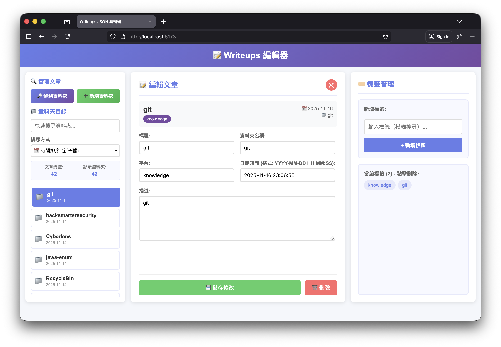

# Vue 3 + TypeScript + Vite
作為以下 blog json 資料編輯頁面的前端  
https://numb2too.github.io/writeups/  
搭配以下後端串連 rest api  
https://github.com/numb2too/writeup-editor-backend  

## 功能說明
1. 鉤稽文章資料夾目錄，快速篩選文章
2. 目錄可依照名稱、時間排序
3. 新增目錄資料夾並且鉤稽 json
4. 偵測已有資料夾新增到 json 
5. 比對 json 與資料夾的資料是否一致
6. 編輯文章相關欄位資料、標籤

## 執行
```bash
npm run dev
```

## 預覽樣式

